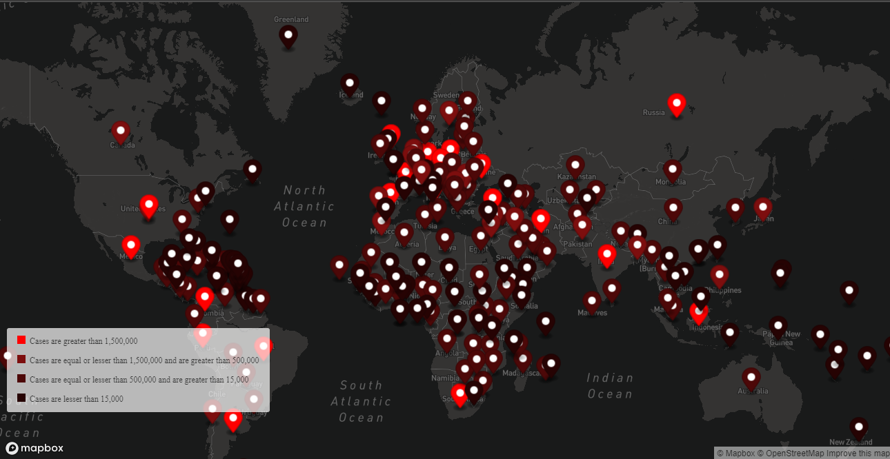

# CoronaPlotter-Web
It is world map that shows the cases of Coronavirus on it. It show it with markers of different colours. The scheme of colours of markers is also give at bottom-left.
## Screenshots


  
## Run Locally

Clone the project
```bash
  git clone https://github.com/HarshitSeth-809014/CoronaPlotter-Web
```

Go to the project directory
```bash
  cd my-project
```

Run the index.html file

  
## Tech Stack

**Client:** HTML, JavaScript
## Authors
Name: Harshit Seth\
Class: 8\
Age: 13 years
- [@HarshitSeth-809014](https://www.github.com/HarshitSeth-809014)
